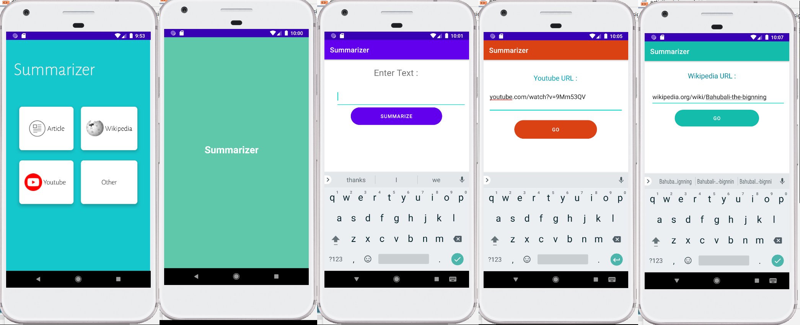

# Summarizer App


## Detailed Overview

The `Summarizer App` is a cutting-edge Android application designed to enhance the efficiency of information consumption in our increasingly digital world. As content multiplies exponentially, the ability to quickly grasp the essence of various texts and videos becomes invaluable. This app embodies this principle by employing state-of-the-art machine learning algorithms to distill lengthy content into digestible summaries.

At its core, the `Summarizer App` uses the `Flask API` as a conduit to large language models such as `T5` and `BERT`, renowned for their natural language understanding and generation capabilities. The app serves as an interface between complex AI technology and the user's need for brevity, making it a potent tool for students, professionals, and any avid learner.

### YouTube Video Summarization

For YouTube videos, the app cleverly taps into the `YouTube API` to fetch video captions as raw text. It then processes this text through the chosen language model, which comprehensively understands the video's content and context. The model strategically extracts key points, themes, and concepts to generate a concise summary. Users can gain insights from video content in a fraction of the time it would take to watch the full material.

### Wikipedia and Article Summarization

When it comes to summarizing Wikipedia articles or web articles, the `Summarizer App` showcases its web scraping proficiency through `Beautiful Soup`. It navigates the HTML and XML of web pages to retrieve relevant text, which, much like the video captions, is then distilled by the LLMs. The result is a coherent and concise synopsis of expansive content, providing users with quick knowledge acquisition capabilities.

### User Experience

Mindful of the user's interaction with the app, the design philosophy of `Summarizer` centers on simplicity and efficiency. The interface is clean and uncluttered, presenting a straightforward choice between summarizing YouTube videos, Wikipedia pages, or textual content. Users can easily paste URLs or text into the app, initiate the summarization with a single tap, and receive a summary almost instantaneously.

By integrating advanced AI technologies into an accessible mobile application, the `Summarizer App` stands out as a beacon of utility and innovation. Its capability to transform verbose information into succinct summaries not only saves time but also makes learning and information gathering more manageable and enjoyable.

We invite users and developers alike to explore the functionalities of the `Summarizer App`, contribute to its growth, and join us in the journey of redefining content consumption.

## Screenshots




*Note: Replace the placeholder paths with the actual file paths to the screenshots in your repository.*

## Installation

```bash
# Clone the repository to your local machine
git clone https://github.com/yourusername/summarizer-app.git

# Navigate to the cloned directory
cd summarizer-app

# Install the necessary dependencies
# (Make sure to list actual commands if there are any specific to your project)
