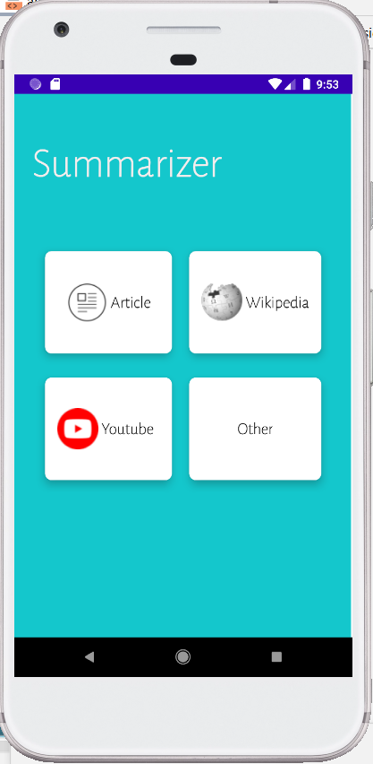

# Summarizer App

## Overview

The Summarizer App is an innovative Android application that leverages Flask API in the backend to summarize YouTube videos, Wikipedia articles, or any text content. Utilizing advanced web scraping techniques with Beautiful Soup and processing through Large Language Models such as T5 and BERT, the Summarizer provides concise summaries, enhancing productivity and knowledge acquisition.

## Features

- **YouTube Video Summaries**: Extracts captions with the YouTube API and summarizes the content using LLMs.
- **Wikipedia Article Summaries**: Scrapes and condenses articles from Wikipedia for quick insights.
- **Text Content Summaries**: Summarizes any textual content input by the user.
- **User-Friendly Interface**: Intuitive UI that guides the user through the summarizing process.

## Screenshots




*Note: Replace the placeholder paths with the actual file paths to the screenshots in your repository.*

## Installation

```bash
# Clone the repository to your local machine
git clone https://github.com/yourusername/summarizer-app.git

# Navigate to the cloned directory
cd summarizer-app

# Install the necessary dependencies
# (Make sure to list actual commands if there are any specific to your project)
